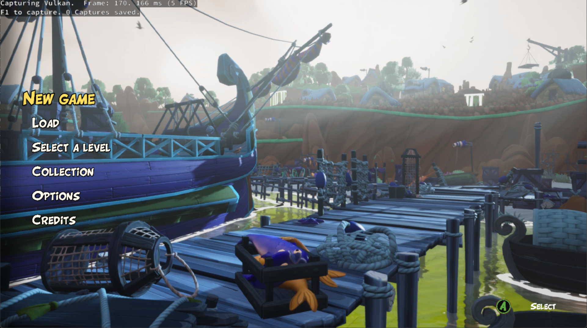
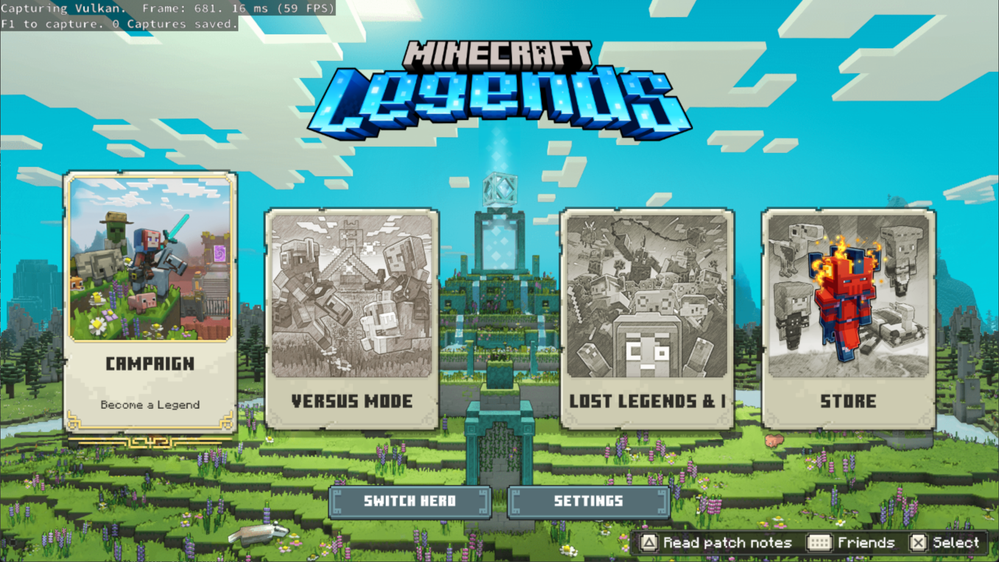

# KytyPS5

KytyPS5 is a PlayStation 5 emulator for Windows. The project is still in an early stage of development, so compatibility is limited and behavior can change quickly between builds.

**Linux support is coming soon.**

## Current Status

KytyPS5 can boot 2D games and some 3D games, including titles built with **Unreal Engine 4/5**, **Unity**, and custom game engines.

No LLE modules are currently required.

The main priority is improving compatibility and fixing boot issues. 100% visual accuracy, completely artifact-free graphics, and "high-FPS performance" are secondary goals at this stage.

Expected issues right now include:

- Graphics glitches or missing effects
- Crashes, freezes, or hangs
- Low FPS
- Incomplete PS5 behavior

## Screenshots

| Disgaea 6 | Asterix & Obelix XXXL |
| --- | --- |
|  |  |

| Dreaming Sarah | Minecraft Legends |
| --- | --- |
|  |  |

| SILENT HILL: The Short Message |
| --- |
|  |

## Special Thanks

- [InoriRus/Kyty](https://github.com/InoriRus/Kyty) - This project is based on a heavily modified version of the original Kyty project.
- [shadps4-emu/shadps4](https://github.com/shadps4-emu/shadps4) - Memory model understanding and AVPlayer implementation reference.
